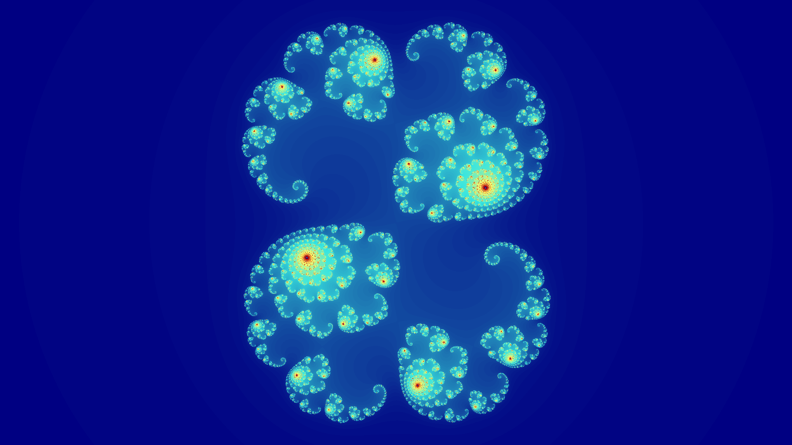

# Requires
* [Cuda Toolkit](https://developer.nvidia.com/cuda-toolkit) (and an NVIDIA card of course!)
* [Rust](https://rustup.rs/)

# How to Use
```
Usage: julia-sets.exe [OPTIONS]                                        
                                                                       
Options:                                                               
  -w, --width <WIDTH>            Width in pixels [default: 1920]       
  -H, --height <HEIGHT>          Height in pixels [default: 1080]      
  -i, --iterations <ITERATIONS>  Number of iterations [default: 500]   
  -x <X>                         Real part of seed [default: 0.285]    
  -y <Y>                         Imaginary part of seed [default: 0.01]
  -t, --top <TOP>                Y-coordinate of top [default: 1.2]    
  -b, --bottom <BOTTOM>          Y-coordinate of bottom [default: -1.2]
  -l, --left <LEFT>              X-coordinate of left [default: -2.1]  
  -r, --right <RIGHT>            X-coordinate of right [default: 2.1]  
  -c, --color-map <COLOR_MAP>    Path to an 8-bit RGB color map of length 256 [default: ./resources/default.cmap]
  -o, --output <OUTPUT>          [default: output.png]
  -h, --help                     Print help
  -V, --version                  Print version
```

# Examples
```shell
cargo run --release -- -w="1920" -H="1080" -i="500" -x="0.285" -y="0.01" -t="1.2" -b="-1.2" -l="-2.1" -r="2.1" -o="output.png"
```

